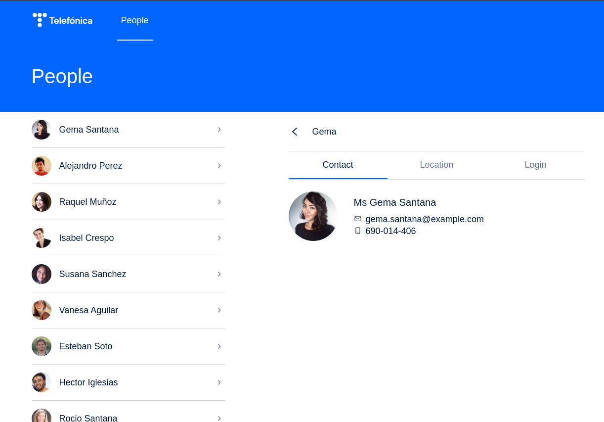
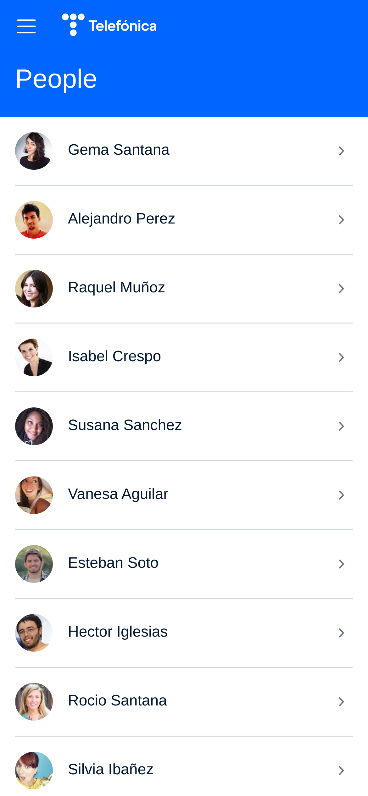
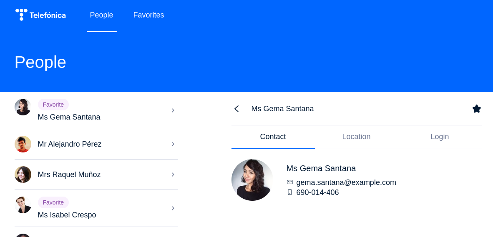

# React code test

## How to send the solution

:warning: **PLEASE, DON'T SEND PULL REQUESTS TO THIS REPOSITORY**

:warning: **PLEASE, DON'T PUBLISH YOUR SOLUTION IN A PUBLIC REPOSITORY**

:warning: **Do not install any additional dependencies.**

Once you have finished the exercise, just copy the `src/` directory into a zip file and send it by email.

Appart from the `src/` directory, you can include a text file with notes or comments if you want, or comment on anything you consider relevant in the email.

## The exercise

You are given this React app skeleton and you need to solve the following tasks. You don't need to solve all of them, but the more you solve the better. Try at least to solve Task1 and Task6, which are the more important. Some tasks are independent, but take into account that to solve some of them you need to first solve the previous ones. For example, you need to solve Task 1 before any other.

You can start by running the app with:

```
yarn && yarn start
```

You'll get some TypeScript errors, but they should disappear once you finish Task 1.

## Tasks

### Task 1: consume the api

Consume the provided api in `src/api.tsx` and render the people list in the App component.

Review the `console.log()` calls in the `onPress` handlers and replace them with the needed logic to select a person when the user clicks on a row and deselect it when the user navigates back.

Implement a loading UI while the user waits for the api response.

Implement an error UI when the api response fails.

We don't expect a fancy UI, a simple/functional one is enough.

Once you have finished Task1, the `app-test.tsx` `"Task1"` test should pass. You can run it with:

```
yarn test
```

The test should pass, but you may see a react warning. Fix it in Task 2.

At this point you should see a fully functional application with a responsive UI working both in mobile and desktop viewports:



<table>
    <tr>
        <td>
        <td>
</table>

Remember that the UI is responsive, because you may need special code for mobile/desktop viewports in some of the following tasks.

### Task 2: fix react warning

There is a react warning in the console:

```
Warning: Each child in a list should have a unique "key" prop
```

Fix it.

### Task 3: desktop empty case

The app ui is responsive and works as a master/detail layout in desktop, with a left side list of people and a detail view in the right side of the screen. When there isn't any selected person from the list, the right side of the UI in desktop is empty, we want to render an empty case there instead.

### Task 4: ui bug in desktop details

There is a bug in the ui in desktop viewport: when we switch between different people, the details tabs (Contact/Location/Login) should reset to the first tab (Contact).

Steps to reproduce the bug:

1. Select any person
2. Click on the Location tab
3. Select a different person

Result: the Location tab is still selected.

Expected behavior: the Contact tab should be selected.

### Task 5: refactor Person name rendering logic

There are different parts of the code where we join the person's first and last name to render the person's full name. This code duplication has also lead to inconsistences in the UI. We want the person's full name to always be rendered in the same way.

### Task 6: implement a favorites list

The user should be able to mark/unmark a person as a favorite.

Add a section to the `MainNavigationBar` with the title `"Favorites"`. When the user navigates to the new `"Favorites"` section, the people list should only show people marked as favorite.

As a user, I want to easily identify a person in the list as a favorite in the `"People"` section too.

Some UI suggestions:

-   You can set right actions to navbars, [like in this example](https://mistica-web.vercel.app/playroom#?code=N4Igxg9gJgpiBcIA8A5AhgNwJYHM0BcsIA7AITQCcAdYgAlvwgAcAxLADxigF5gAzNABsAzjAC%2BNeiXJgA1rwAUASlrcAfLWBiJdBlnyCY3KiBYBXQWmL6ItWLQAqQk5NoVcAC3y9X9VJlwCIjJKAEEwQhIAcQoIMyY1X3paf2w8SJCKcIzaSiw0AFpLACMYQWMQAFViAFtKWVzhWgEMCHd8GBNaEgAFChhhYUUVdU1tRN1k5KQASUhiAGV8SjZBQyhaSEE2irAzCn7ifABhCG3qEFoAegmpvyv0NKDpMIjg2%2BmHgPTg8iy36KxeIfHQ3Gg0VKBDJ-VyMVgcLi8AQicSuF5yYaqDRaHT0QgGIwmcyWayMOwwRzOECudw4Lw%2BSYpR5Q36vDIxOIJJJ%2BZk-F7-HJ5QolMoVACy9UazUwbX0nUuvX6g0xoxxHzuKTmJCWlAASjAcBZKJszjsTHsDjAjqdzl0wYz7rznplsu8kkgvk9oWzghzga5QRMQAAaED4DwwGoDBAAbRADjKMD4JCwYDQIAAuqGAO5YKDh4SxgDMADYAAwZsRAA). You can use a filled/unfilled star icon to toggle the person as fovorite.
-   To mark a favorite person in list row, you can conditionally use a `headline` `Tag` [like in this example](https://mistica-web.vercel.app/playroom#?code=N4Igxg9gJgpiBcIA8AlCB3AOgOwAS4AsYBDKAGwEtsYBeYJAFWIHNcAXATwAdbMQuAThAC2EPgD4AYsQBuEARTYwkAeibNxAXxz5iAZz0w2dHflxIAwhQFgyMU2dx6KAL1rAALAAZteR7gAjYjAAa2YhAFdsKABJYRZ3PgI2Ni49eBUVAWJokQjDAQA6YRgVYi4KFS55NmzFPRUSqEaYbBUAdnbCgCsuZj5fRxVxU0H2RTsaPkkIshzFCFxYXCYyPlMIbAAFARgDOgAKAEpcGnFcYE1fYZwQABoQNiISvQQAbRAGGDsAM02KMDEEAAXQe6AoUCer3gbwAzAA2LzAzRAA).

All the components in the above UI examples can be imported from `@telefonica/mistica` package.

**Tip**: you'll need to replace the `console.log` in the `onPress` handler of `MainNavigationBar` with the code needed to switch between sections.

Here is an example of the expected UI:



### Task 7: write a test for Task 6

Write one or more tests in `app-test.tsx` to cover the feature implemented in Task 6.

### Task 8: implement persistence

Implement a local persistence using `localStorage` or any other method. We want to persist favorites too. Also, take into account that server data may change, so we don't want to use cached data forever.
